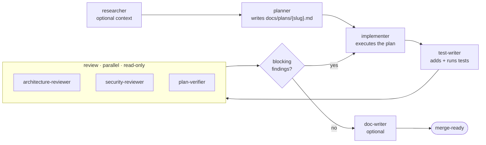

# DevDigest — Custom Subagents

Project-scoped Claude Code subagents for DevDigest. Each agent is a single
`<name>.md` file: YAML frontmatter (`name`, `description`, `tools`, `model`) plus
a Markdown body that becomes the agent's entire system prompt.

> **Loading:** new or edited agent files only become invokable after a **session
> restart** (or when created via the `/agents` UI) — they're read at session start.

## Available agents

| Agent | Model | Role | Writes? | Tools |
|-------|-------|------|---------|-------|
| [`researcher`](./researcher.md) | `sonnet` | Read-only lookup — searches **this codebase** or the **web** and returns a short, strictly-formatted answer with citations. Prefix a request with `[code]` or `[web]` to force the search type. | No | `Read, Grep, Glob, WebSearch, WebFetch` |
| [`planner`](./planner.md) | `opus` | Turns a feature request into a precise, ordered, verifiable implementation plan and saves it to `docs/plans/<slug>.md`. Plans only — never edits source. | Plan file only (`docs/plans/`) | `Read, Grep, Glob, Write` |
| [`implementer`](./implementer.md) | `sonnet` | Executes an existing plan — writes/edits frontend + backend code, loads the skills relevant to the module, then verifies with typecheck/test/build. Executes only — doesn't design. | Yes (code, tests) | `Read, Grep, Glob, Edit, Write, Bash` |
| [`test-writer`](./test-writer.md) | `sonnet` | Adds behavior-focused tests across all four packages (`client/`, `server/`, `reviewer-core/`, `e2e/`), discovering existing test conventions, then **runs** typecheck + tests and pastes the real output. Minimises mocking by design. Tests only — doesn't redesign the code under test. | Yes (tests only) | `Read, Grep, Glob, Edit, Write, Bash` |
| [`architecture-reviewer`](./architecture-reviewer.md) | `opus` | Read-only architectural review — dependency direction, layering, coupling/cohesion, boundaries, SoC. High-signal findings (severity + principle + direction), never code rewrites. Reuses the repo's `CRITICAL/WARNING/SUGGESTION` vocabulary. | No | `Read, Grep, Glob` |
| [`plan-verifier`](./plan-verifier.md) | `sonnet` | Read-only completeness-**and-scope** gate — maps each planned requirement to `file:line` + test evidence (Implemented / Partial / Missing / Cannot-verify) **and** maps every change in the diff back to a requirement, flagging out-of-scope work. Emits a traceability matrix + verdict. Coverage, not quality. | No | `Read, Grep, Glob, Bash` |
| [`security-reviewer`](./security-reviewer.md) | `opus` | Read-only, **local-only** security review of the current diff — checks changed code against OWASP Top 10:2025 + the OWASP LLM Top 10 (incl. the secrets/untrusted-input/exfil "lethal trifecta"), reasons about reachability, and aggregates grounded `file:line` findings by severity **High / Medium / Low** each with a `0.0–1.0` confidence score. Findings only — never edits, never hits the network. | No | `Read, Grep, Glob, Bash` |
| [`doc-writer`](./doc-writer.md) | `sonnet` | Turns code, plans, or notes into well-placed documentation — picks the Diátaxis type (tutorial / how-to / reference / explanation / ADR) and the location (`docs/`, module `README`/`CLAUDE.md`, `docs/adr/`), writes docs-as-code, and adds Mermaid only where it earns its place. | Yes (docs) | `Read, Grep, Glob, Write, Edit` |

## The feature pipeline (how they fit together)

For a non-trivial feature the agents form a pipeline. **The primary session is the
orchestrator** — it invokes each agent, reads what comes back, and decides the next
step. Subagents are **leaf workers**: none of them holds the `Task`/`Agent` tool, so
**an agent cannot spawn another agent** (the planner can't itself "fire" the
researcher). All sequencing, fan-out, and loop-back happen one level up, in the
session driving them — or in a `Workflow` script, which is the only mechanism that
orchestrates agents deterministically (agents still stay leaves).

> **Run it in one command:** the [`ship-feature`](../skills/ship-feature/SKILL.md)
> skill (`/ship-feature <request>`) codifies this exact pipeline — the main session
> follows it to drive the stages below, including the approval gate and the review loop.

**Stage by stage:**

1. **researcher** *(optional)* — targeted lookups before planning ("how does X work
   here?", "[web] what do the library docs say?"). Skip it when the planner's own
   reading suffices.
2. **planner** *(opus)* — turns the request into an ordered, verifiable plan at
   `docs/plans/<slug>.md`. **Stop here for your approval** before any code is written.
3. **implementer** *(sonnet)* — executes the approved plan; verifies with
   typecheck / lint / test / build.
4. **test-writer** *(sonnet)* — adds behavior-focused tests and runs them.
5. **review — run the three in parallel** (all read-only, independent, so fan them
   out at once): **architecture-reviewer** (design / layering / boundaries) ·
   **security-reviewer** (OWASP + LLM-trifecta on the diff) · **plan-verifier**
   (completeness *and* scope vs the plan).
6. **gate + loop-back** — the orchestrator collects findings. If any are blocking (a
   `CRITICAL`, a High-severity security finding, or a `plan-verifier` GAP), hand them
   back to the **implementer** to fix, then **re-run only the affected reviewers**.
   Repeat until reviews are clean *or* a round produces no new changes (convergence
   guard — don't loop forever on a disputed finding; surface it for a human instead).
7. **doc-writer** *(optional)* — once green, document the change (README / ADR /
   architecture doc).

**Conventions that make the pipeline work:**

- The **handoff artifact is a file** (`docs/plans/<slug>.md`). A subagent gets no
  parent conversation history, so the plan file *is* the contract between planner,
  implementer, test-writer, and the reviewers — keep stages stateless across that
  boundary, and when looping back pass the findings to the implementer explicitly.
- **Parallelise the review stage, serialise everything else.** Stages 1–4 each depend
  on the previous one's output; the three reviewers in stage 5 don't depend on each
  other, so launch them together.
- **Skill routing:** the code-acting and review agents (`planner`, `implementer`,
  `test-writer`, `architecture-reviewer`, `security-reviewer`) carry a
  *module → skill* table in their bodies and `Read` only the 1–2 relevant
  `.claude/skills/<name>/SKILL.md` files on demand (rather than the `skills:`
  frontmatter field, which would preload every skill into context).
- Custom project agents **auto-load the `CLAUDE.md` hierarchy** for their CWD; module
  docs (`<module>/CLAUDE.md`, `<module>/INSIGHTS.md`, `docs/*`) are read on demand.
- **Cost discipline.** Real-run telemetry showed **cache-read ≈ 93% of all tokens** —
  each agent's context re-billed every turn — so cost tracks **conversation length ×
  context size**, not the model tier (tiers above are already tuned: reasoning-heavy
  `planner`/`architecture-reviewer`/`security-reviewer` on `opus`, executors and
  `plan-verifier` on `sonnet`, ad-hoc exploration on Haiku). Keep runs cheap by keeping
  them short and lean: one-retry-then-DIY on a dropped agent, split a big build by
  layer, hand agents exact file lists, scope re-validation to specific findings, and
  don't poll background agents. The [`ship-feature`](../skills/ship-feature/SKILL.md)
  skill's **"Cost & robustness discipline"** section is the authoritative playbook.

## Invoking

- **Auto-delegation:** Claude routes to an agent based on its `description`. The
  planner/implementer descriptions include "use proactively" triggers.
- **Explicit:** ask for it by name — e.g. *"use the planner to design X"*,
  *"have the implementer build docs/plans/x.md"*, *"ask the researcher how Y works"*.

## Sources & references

General subagent design (applies to all agents):

- [Create custom subagents — Claude Code Docs](https://code.claude.com/docs/en/sub-agents)
  — frontmatter fields, model aliases (`sonnet`/`opus`/`haiku`/`fable`/`inherit`),
  `tools` inheritance, and `description`/system-prompt guidance.

The **`implementer`** agent's prompt was researched from (June 2026):

- [Best practices for Claude Code — Anthropic](https://code.claude.com/docs/en/best-practices)
  — evidence-first verification, scope discipline, adversarial review.
- [Effective harnesses for long-running agents — Anthropic Engineering](https://www.anthropic.com/engineering/effective-harnesses-for-long-running-agents)
  — one-step-at-a-time execution, test before marking complete.
- [Effective context engineering for AI agents — Anthropic Engineering](https://www.anthropic.com/engineering/effective-context-engineering-for-ai-agents)
  — just-in-time context, structured note-taking.
- [Claude Code system prompts (reverse-engineered) — Piebald-AI](https://github.com/Piebald-AI/claude-code-system-prompts)
  — "do not add features beyond what was asked"; deviation/scope guidance.

The **`planner`** and **`researcher`** agents are project-authored and predate
this documentation; they follow the general subagent docs above (no separate
external source). The **`plan-verifier`** and **`doc-writer`** agents are also
project-authored — each converted from the former same-named *skill* (their procedure
and reference material folded into the agent body). DevDigest-specific conventions
they all honor live in root [`CLAUDE.md`](../../CLAUDE.md) and
[`INSIGHTS.md`](../../INSIGHTS.md).

The **`test-writer`** and **`architecture-reviewer`** agents were researched
(June 2026) from:

- **test-writer** — [Fastify Testing](https://fastify.dev/docs/latest/Guides/Testing/)
  (`inject`, lifecycle teardown), [TkDodo — Testing React Query](https://tkdodo.eu/blog/testing-react-query)
  (`retry:false`/`gcTime:Infinity`, per-test `QueryClient`, MSW),
  [Testing Library query priority](https://testing-library.com/docs/queries/about/),
  and [arXiv 2602.00409](https://arxiv.org/html/2602.00409v1) — coding agents
  over-mock ~95% of the time; explicit no-mock instructions are the proven fix.
- **architecture-reviewer** — [Augment Code — high-quality AI review](https://www.augmentcode.com/blog/how-we-built-high-quality-ai-code-review-agent)
  (signal-over-noise, ~1–3 findings/review), [Conventional Comments](https://conventionalcomments.org/)
  (severity labels), [operationalizing ADRs with fitness functions](https://platformtoolsmith.com/blog/operationalizing-adrs-fitness-functions/)
  (anti-rationalization), and [arXiv 2201.01184](https://arxiv.org/pdf/2201.01184)
  — manual review alone catches ~17% of architecture drift.
- **security-reviewer** — [OWASP Top 10:2025](https://owasp.org/Top10/2025/),
  [OWASP Top 10 for LLM Applications 2025](https://genai.owasp.org/llm-top-10/), and
  [CVSS v3.1 — FIRST.org](https://www.first.org/cvss/v3.1/specification-document) for
  the High/Medium/Low + confidence rubric (full list in `security-reviewer.md`).
- **doc-writer** — the [Diátaxis](https://diataxis.fr/) framework (documentation type
  by reader need) plus Nygard/MADR ADR structure; converted from the `doc-writer` skill.

The **`security-reviewer`** agent was researched (June 2026) from:

- [OWASP Top 10:2025](https://owasp.org/Top10/2025/) — current category list
  (SSRF merged into A01), the basis for its OWASP mapping table.
- [OWASP Top 10 for LLM Applications 2025](https://genai.owasp.org/llm-top-10/)
  — LLM01/02/05/06/07/10 and the "lethal trifecta" (untrusted input + private
  data + exfil path), which the repo already models via `TrifectaComponent` in
  `server/src/vendor/shared/contracts/findings.ts`.
- [CVSS v3.1 Specification — FIRST.org](https://www.first.org/cvss/v3.1/specification-document)
  — the qualitative High/Medium/Low severity bands (used as a reasoning rubric,
  not a published numeric score). It also `Read`s the in-repo `security` skill
  (OWASP Top 10:2025, confidence-based review) for stack-specific safe/unsafe pairs.
