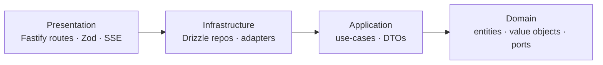

# Backend Onion Architecture (DevDigest)

Enforces **strict Onion Architecture** (a.k.a. Clean / Hexagonal Ports-and-Adapters) on the
DevDigest backend: `server/` (`@devdigest/api`) and `reviewer-core/` (`@devdigest/reviewer-core`).
The one rule that subsumes everything else: **source-code dependencies point only inward. Inner
layers know nothing about outer layers.**

## When to use

Use this skill when working on backend code and you need to decide **where code belongs** or
**which direction a dependency may point**:

- Adding or reviewing a `server/` module (`routes.ts` / `service.ts` / `repository.ts`).
- Deciding where business logic, DB access, input validation, or an external-API call lives.
- Introducing a domain entity, value object, repository interface, or use-case.
- Wiring a new adapter/port through the DI container (`platform/container.ts`).
- Keeping `reviewer-core` pure, or reviewing a change that touches it.

For **client/Next.js** structure, use `ui-frontend-architecture` instead. For tool-level syntax,
defer to the sibling skills: `fastify-best-practices`, `drizzle-orm-patterns`, `zod`,
`postgresql-table-design`, `typescript-expert`.

> **Judgment:** strict onion is the default here, but a trivial passthrough endpoint with no
> business rule does not need a hand-written entity + use-case. The non-negotiables even for the
> simplest code are the **dependency direction** and **no Drizzle/Fastify in inner layers**. Add
> entities/value-objects/use-cases as soon as there is a real invariant or orchestration to own.

## The four layers

Dependencies point **inward only** (→ means "may depend on"): Presentation → Infrastructure →
Application → Domain. Domain depends on nothing.

| Layer | Owns | May import | MUST NOT import | DevDigest home |
|-------|------|-----------|-----------------|----------------|
| **Domain** (core) | Entities, value objects, domain services, **repository interfaces (ports)** | only other domain code, pure stdlib | `drizzle-orm`, `fastify`, `zod`, `openai`, `@anthropic-ai/sdk`, `../db`, any adapter | `reviewer-core/src/*` (the exemplar pure core); new domain types per module |
| **Application** | Use-cases / application services, command/query + result DTOs, orchestration | Domain (interfaces + entities) | `fastify` request/reply, `drizzle-orm`, concrete adapters | `server/src/modules/*/service.ts` |
| **Infrastructure** | Repository **implementations**, adapters (LLM/git/github/secrets), external clients; row→entity mapping | Application, Domain | Presentation | `server/src/modules/*/repository.ts`, `server/src/adapters/*`, `server/src/db/*` |
| **Presentation** | Fastify routes (thin), Zod boundary schemas, SSE, HTTP error mapping | everything inward (via DTO/service) | the DB / Drizzle directly | `server/src/modules/*/routes.ts`, `server/src/app.ts` |

Each layer is detailed in `references/`:

- [references/domain-layer.md](references/domain-layer.md) — entities, value objects, ports
- [references/application-layer.md](references/application-layer.md) — use-cases, DTOs
- [references/infrastructure-layer.md](references/infrastructure-layer.md) — Drizzle repos, adapters, mapping
- [references/presentation-layer.md](references/presentation-layer.md) — Fastify + Zod at the edge
- [references/dependency-injection.md](references/dependency-injection.md) — ports/adapters + composition root
- [references/dependency-rule.md](references/dependency-rule.md) — the rule + copy-paste dependency-cruiser config
- [references/migration-from-current.md](references/migration-from-current.md) — today's layout → strict onion

Good-vs-bad code pairs for every rule below live in [examples.md](examples.md).

## The Dependency Rule

- An arrow is the **only** legal direction of a source import. There is never an arrow back out.
- When an inner layer needs an outer capability (DB, HTTP client, LLM), it **declares an interface
  (port) it owns**, and an outer layer provides the implementation (adapter). This is the
  Dependency Inversion Principle — the inversion is what lets the arrows stay inward.
- The rule is enforced mechanically, not by review alone: see the `dependency-cruiser` config in
  [references/dependency-rule.md](references/dependency-rule.md). `dependency-cruiser@17.4.3` is
  already a `server/` dependency.

## Tool → layer mapping (our stack)

- **Fastify 5** — *presentation only*. Route handlers validate, resolve a service from the
  container, and return a DTO. No `FastifyRequest`/`FastifyReply` type ever appears in
  application/domain code. (`fastify-best-practices` for handler/plugin syntax.)
- **Zod 3** — *boundary tool*. Validate inbound DTOs at the edge with `fastify-type-provider-zod`;
  derive types with `z.infer`. Inner layers receive already-valid data and never re-`.parse()`.
  (`zod` skill for schema syntax.)
- **Drizzle ORM 0.38 + `postgres` + pgvector** — *infrastructure only*. Lives behind a repository
  interface owned by the domain. Map `typeof table.$inferSelect` rows to domain entities; never
  return a raw Drizzle row outward. (`drizzle-orm-patterns` for query syntax,
  `postgresql-table-design` for schema.)
- **OpenAI / Anthropic / OpenRouter SDKs** — *infrastructure adapters* behind ports
  (`LLMProvider`, `Embedder`), injected via the container; never imported by a service directly.

## Composition root

`server/src/platform/container.ts` is the **single composition root** — the one place concrete
implementations are bound to ports. Services and handlers receive abstractions
(`container.git`, `container.reviewRepo`, `await container.llm('openai')`), not concrete classes.
Tests pass `ContainerOverrides` to swap in mocks (`server/src/adapters/mocks.ts`). The port
interfaces themselves live in `@devdigest/shared` (vendored), keeping them framework-free.
See [references/dependency-injection.md](references/dependency-injection.md).

## Pre-commit checklist

1. Does any **inner** file import `drizzle-orm`, `fastify`, `zod`, or an SDK — **including a
   type-only `import type`** (e.g. a domain type defined as `InferSelectModel<typeof table>` or
   `typeof table.$inferSelect`)? → move it outward; declare an **independent** domain type and let
   the repository `toDomain()`-map onto it. A type alias is erased at runtime, so `depcruise`
   may miss it — but it still binds the core to the DB shape, so catch it in review.
2. Does a **route handler** touch the DB / Drizzle? → push it into a service + repository.
3. Does a repository **return a Drizzle row** outward? → add a `toDomain()` / DTO mapper.
4. Does a domain entity hold **only data** with logic elsewhere? → fold the invariant into the
   entity (avoid the anemic-domain anti-pattern).
5. Is a concrete adapter constructed **outside** the container? → bind it in `container.ts`.
6. Does `reviewer-core` import anything with DB/HTTP/FS side effects? → it must stay pure.
7. Run `pnpm exec depcruise` (config in [references/dependency-rule.md](references/dependency-rule.md)) — zero violations.

## Versioning

This skill uses **semver**, kept in sync across `metadata.version` (this file), `tile.json`, and
`CHANGELOG.md`. On any change, bump and add a CHANGELOG entry in the same edit:

- **MAJOR** — a rule change that flags previously-compliant code (e.g. tightening the
  dependency-cruiser ruleset, mandating a new layer or mapping).
- **MINOR** — additive guidance: a new reference doc, example pair, or trigger term.
- **PATCH** — wording, typo, or link fixes with no behavioral change.
