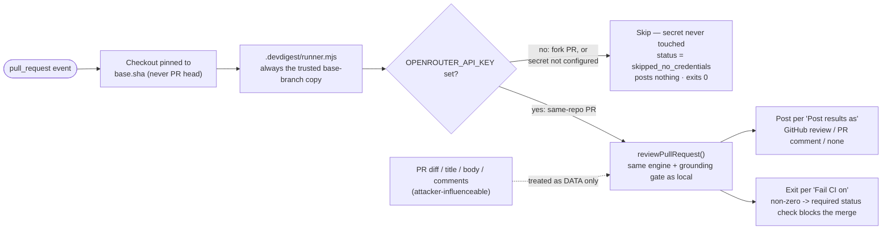

# 0001. Security model for exporting a review agent to CI

- Status: Accepted
- Date: 2026-07-12

## Context

SPEC-05 ("Export Review Agents to CI") lets a maintainer deploy a debugged review
agent so it runs automatically, inside GitHub Actions, on every pull request in a
real repository. That single change moves the agent from a threat model where it's
safe by construction — the maintainer runs it by hand, locally, against repos they
chose to import — into one where three dangerous things sit in the same execution
context at once:

1. **Untrusted input** — the PR diff, title, body, and any comment text, fully
   attacker-controlled on a fork PR.
2. **A capability to act** — write access to the PR (post a review/comment) and,
   via a required status check, the power to block a merge.
3. **A secret** — the LLM API key the review needs to run at all.

Any code path where all three meet is a "lethal trifecta": untrusted content that
can influence a component holding both a secret and the ability to act is a
prompt-injection / secret-exfiltration / RCE surface, not just a hypothetical risk.
This is the core problem SPEC-05 has to solve, not a follow-on concern — "Security
guarantees" is called out as the spec's "core WHY" (`specs/SPEC-05-2026-07-12-export-agents-to-ci.md`
AC-25…AC-29).

Two constraints shape the solution space:

- **No GitHub App.** This product doesn't have an App installation surface, so
  merge-gating has to be built from plain Actions primitives (exit code + a
  repository required status check) rather than a scoped, revocable App token.
- **The deployment is a reviewed artifact, not a black box.** Every file lands in
  one PR onto a `devdigest/ci` branch that a human merges. The security model has
  to survive being *read*, not just be technically sound — hidden behavior in a
  marketplace action would defeat the "a maintainer can read every line" goal
  (AC-29) even if that action were itself safe.

## Decision

The generated deployment (`server/src/modules/ci/workflow.ts`, `runner/src/runner.ts`)
is minimal-by-construction. Every mitigation below is enforced in code, not just
documented, and has a regression test:

1. **Least-privilege `permissions:`** — exactly `contents: read` and
   `pull-requests: write`, nothing broader (AC-25; asserted in `bundle.ts`'s test
   suite by parsing the generated YAML).
2. **The secret is referenced, never embedded.** The workflow reads
   `${{ secrets.OPENROUTER_API_KEY }}`; `GITHUB_TOKEN` comes from the CI-provided
   `${{ github.token }}`. The `AgentManifest` schema (`contracts/eval-ci.ts`) has no
   secret field at all, so a valid manifest structurally cannot carry a key (AC-26).
3. **Trigger is `pull_request`, never `pull_request_target`.** A `pull_request_target`
   job runs with the *base* repo's secrets and a write-scoped token even for a fork
   PR — the single most common GitHub Actions foot-gun, and exactly the hole this
   design closes (AC-27/28; see the workflow's own comment block).
4. **Skip-on-no-credentials, checked first.** `runner.ts`'s `run()` checks
   `env.OPENROUTER_API_KEY` before constructing an LLM client or making any GitHub
   call. When it's empty (a fork PR, or the secret simply isn't configured yet), the
   runner accesses no secret, posts nothing, writes an artifact with
   `status: 'skipped_no_credentials'`, and exits `0` — never blocking the merge
   (AC-27).
5. **PR content is data, never instructions.** The diff, title, body, and any
   comment text flow straight into `reviewer-core`'s own grounding + injection guard
   (`wrapUntrusted`); the workflow itself only ever fires on `pull_request` events —
   never `issue_comment` — so comment text has no path to *triggering* anything
   (AC-28).
6. **No marketplace or external action.** The only `uses:` line is first-party,
   SHA-pinned `actions/checkout`. The entire review engine ships inside the
   committed `.devdigest/runner.mjs` bundle (built by `runner/`, esbuild-bundled),
   so there is no third-party supply-chain trust and nothing hidden from a
   maintainer reading the export PR (AC-4/29).
7. **Checkout is pinned to `ref: ${{ github.event.pull_request.base.sha }}`, never
   the PR's head or the default `pull_request` merge ref.** This is the load-bearing
   fix, caught during implementation review — see "A real vulnerability, and how it
   was closed" below.
8. **Merge-gating without a GitHub App.** "Fail CI on" (Critical / Warning+ / Never)
   is enforced by reviewer-core's own deterministic gate helpers
   (`gateTriggered`/`countBlockers`/`verdictFromFindings`) — reused, never
   re-implemented, in the runner — which decide the process exit code. Paired with a
   maintainer adding a required status check in the repo's branch protection (a
   documented **manual** step; the wizard does not and cannot configure branch
   protection itself), a non-zero exit blocks the merge with no App involved
   (AC-21/22/23).

### A real vulnerability, and how it was closed

The default `pull_request` GitHub Actions event checks out the PR's **merge
commit** — which includes the PR author's own edits to every file, including
`.devdigest/runner.mjs` itself. The very next workflow step executes that checked
out file with `OPENROUTER_API_KEY` present in the environment. Put those two facts
together and an unpinned checkout is a full compromise of everything mitigation #2–5
were built to prevent: a same-repo PR that edits `.devdigest/runner.mjs` gets its
*own* edited version executed with the real API key; a fork PR gets outright remote
code execution using the run's `GITHUB_TOKEN`, even with no LLM secret in play at
all (exfiltrate the token, comment, relabel, close the PR, etc.).

This was caught during review of the generated workflow, not found in the wild. The
fix is one line: `actions/checkout`'s `with: { ref: ${{ github.event.pull_request.base.sha }} }`.
The runner still fetches the PR *diff* to review via the GitHub REST API separately
— never from this checkout — so pinning to `base.sha` changes nothing about review
behavior. It only guarantees the code that **runs** is always the trusted
base-branch copy, never anything the PR touched. See the extended comment above the
`checkout` step in `server/src/modules/ci/workflow.ts` (`generateWorkflow`) — do not
weaken or remove that pin without re-reading this ADR.

**The pin's own bootstrap gap.** The `base.sha` pin has one built-in consequence: the
export PR that first commits `.devdigest/runner.mjs` is, by definition, checked out
at a `base.sha` that predates that commit — the file simply isn't there yet on the
target branch. Left unhandled, that PR's own CI run crashes
(`Error: Cannot find module '.../.devdigest/runner.mjs'`), which reads as the feature
being broken when it's actually the security pin working as designed (observed in
[stdroniv/dev-digest#14](https://github.com/stdroniv/dev-digest/pull/14)). The run
step (`server/src/modules/ci/workflow.ts`) checks for the file's existence before
invoking it and exits `0` with an `::notice::` when it's missing, so the export PR's
own check reads as "not yet active" rather than "failed." This does not touch the
`base.sha` pin itself — it only makes the one PR that can't yet benefit from it fail
gracefully instead of crashing.

## Consequences

**Easier:**
- A maintainer can review and approve the export PR top-to-bottom with no external
  action to trust — everything that will execute is visible in the diff.
- Fork PRs cannot exfiltrate the API key through *any* code path in this design,
  including a maliciously crafted `.devdigest/runner.mjs` committed inside the fork
  PR itself — the base-sha pin means that file is never the one that runs.
- The distinct `skipped_no_credentials` status keeps "no key configured yet" visibly
  different from a runner failure or a clean pass, both in the artifact and on the
  CI Runs page — an operator isn't left guessing why a fork PR shows no review.

**Harder / accepted limitations:**
- Merge-blocking depends on the maintainer manually adding a required status check;
  DevDigest cannot enforce this from the studio (spec Non-goal — no branch
  protection automation).
- The runner can't be granted broader capabilities (auto-merge, labeling, etc.)
  without the maintainer explicitly widening the generated `permissions:` block
  themselves — deliberately outside this feature's scope.
- Deleting or disabling an exported agent in the studio does not remove the
  committed workflow; the repo keeps running it until a maintainer edits the repo
  directly (known limitation, not a security defect — the workflow is inert without
  a repo-owned secret DevDigest never provisions).
- Rebuilding `runner/src/**` requires re-running `node build.mjs` and re-committing
  `runner/dist/runner.mjs` by hand; nothing invalidates a stale bundle automatically.

## Alternatives considered

- **`pull_request_target` trigger** — rejected outright. It would hand fork PRs the
  base repo's secrets and a write-scoped token, defeating the "no secret ever
  reaches a fork PR" guarantee this design exists to provide.
- **A GitHub App with a scoped installation token** — would give tighter,
  per-repo-revocable scoping than a shared `secrets.*` PAT, but requires a hosting
  and app-approval surface this product doesn't have yet. Explicitly out of scope
  for SPEC-05 (spec Non-goals); the manual "add the secret, add a required status
  check" path is the interim, zero-infrastructure alternative.
- **A published/marketplace `devdigest/review-action@v1`** — rejected. It would
  introduce a third-party trust dependency and hide the review logic from the
  maintainer reading the export PR. The design bundles the runner in-repo instead,
  at the cost of needing to keep `runner/dist/runner.mjs` rebuilt and re-committed
  whenever the runner's source changes.
- **Unpinned checkout (the default `pull_request` ref)** — this *was* the design
  until it was caught in review (see above). Recorded here explicitly so a future
  edit to `workflow.ts` doesn't quietly regress it back out.
- **Treating "no credentials" as an ordinary failure** — rejected in favor of a
  distinct `skipped_no_credentials` status, so a fork PR with no secret reads as
  "skipped" rather than a false "Failed" on the CI Runs page.

## Trust boundary at a glance

## Where the mitigations live

| Mitigation | Code |
|---|---|
| `permissions:` block | `server/src/modules/ci/workflow.ts` (`generateWorkflow`) |
| Secret reference, never embedded | `server/src/modules/ci/workflow.ts`; `contracts/eval-ci.ts` `AgentManifest` (no secret field) |
| `pull_request` not `pull_request_target` | `server/src/modules/ci/workflow.ts` `on:` block |
| Skip-on-no-credentials | `runner/src/runner.ts` `run()`, checked before any GitHub/LLM call |
| Data-not-instructions for PR content | `reviewer-core`'s `wrapUntrusted`/`INJECTION_GUARD`, invoked from `runner/src/runner.ts` via `reviewPullRequest` |
| No marketplace action | `server/src/modules/ci/constants.ts` `ACTIONS_CHECKOUT_USES` (the only permitted `uses:`) |
| Checkout pinned to `base.sha` | `server/src/modules/ci/workflow.ts`, the `Check out repository` step |
| Merge-gate exit code | `runner/src/runner.ts`, via `reviewer-core`'s `gateTriggered`/`countBlockers`/`verdictFromFindings` |

## Related

- Spec: `specs/SPEC-05-2026-07-12-export-agents-to-ci.md` — "Untrusted inputs" and
  "Security guarantees (core WHY)" (AC-25…AC-29).
- Plan: `docs/plans/export-agents-to-ci.md` — Risks & mitigations.
- How-to + explanation: [`../export-agents-to-ci.md`](../export-agents-to-ci.md).
