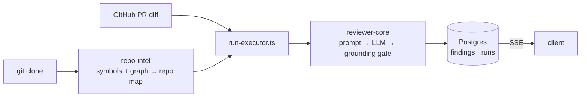

# Architecture — the review pipeline

The single deeper reference for *how a review happens end to end*. CLAUDE.md files
link here instead of duplicating it. Package-level diagrams live in each
package's README; this doc is the cross-package flow.

## End to end

1. **Add a repo** — `server` (`modules/repos`) `git clone`s it into
   `DEVDIGEST_CLONE_DIR` and `repo-intel` indexes it (symbols + import graph →
   ranked **repo map**). The repo shows an **Indexed** badge.
2. **Import PRs** — `modules/pulls` pulls open PRs from GitHub (diff, commits,
   body, linked issue) via the GitHub adapter.
3. **Run a review** — `POST /pulls/:id/review` → `modules/reviews/run-executor.ts`
   loads the diff, gathers context (repo map + caller signatures when indexed and
   enabled), and calls `reviewPullRequest()` in `reviewer-core`.
4. **Engine** (`reviewer-core`): `assemblePrompt()` (+ `INJECTION_GUARD`,
   `wrapUntrusted()`) → injected `LLMProvider` → structured output
   (Zod→JSON Schema, parse-with-repair) → **`groundFindings()`** drops any finding
   not citing a real diff line → score recomputed from survivors.
5. **Persist** — findings (severity + grounded location), verdict, score, and run
   trace are stored via Drizzle; the client streams run progress over SSE.

## Trust & determinism (the two load-bearing ideas)

- **Grounding gate** — the model cannot hallucinate a location; uncited findings are
  dropped and the score is derived mechanically, not trusted from the model.
- **Injection defense** — a single trusted rule (`INJECTION_GUARD`) treats all
  untrusted content (diff, PR body, README, comments) as data, never instructions.
  No keyword denylists.

## Where to go deeper

- API surface & DI → [`../server/README.md`](../server/README.md)
- Engine internals & public API → [`../reviewer-core/README.md`](../reviewer-core/README.md)
- The indexer → [`../server/src/modules/repo-intel/README.md`](../server/src/modules/repo-intel/README.md)
- Agent prompts → [`agent-prompts/README.md`](agent-prompts/README.md)
- Testing & CI → [`../TESTING.md`](../TESTING.md)
