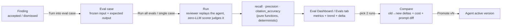

# Eval Pipeline — regression-testing a reviewer agent

For a maintainer who edits reviewer agents (system prompt, model, skills) and wants
to know whether an edit made the agent better or worse, without re-reading reviews by
hand. Covers the day-to-day workflow (create a case, run it, compare two runs,
promote) and, at the end, a short reference on how the scoring actually works.

Cross-references SPEC-04 (`specs/SPEC-04-2026-07-08-eval-pipeline.md`) and its plan
(`docs/plans/eval-pipeline.md`); read those for the full acceptance-criteria list and
the task-by-task build history. For the review pipeline the eval harness scores
against, see [`architecture.md`](architecture.md).

## The idea

DevDigest already has a labelled dataset it was throwing away: every **accept** /
**dismiss** decision a maintainer makes on a finding is a judgement call — "this was
right" or "this was noise." The eval pipeline turns those decisions into a frozen
regression case, replays an agent against the whole case set, and scores the result
**entirely in code, with zero LLM calls**. Judging is deterministic string/line
comparison (`server/src/modules/eval/scoring/`), so the same inputs always produce
the same numbers — only *producing* the findings costs a model call.

Three metrics come out of a run:

- **recall** — did the agent still find what it should.
- **precision** — did it stay quiet where it should (this is where **dismissed**
  cases earn their keep — a noisy prompt tanks precision, not recall).
- **citation_accuracy** — did its findings survive the grounding gate (cite a real
  `file:line` inside the frozen diff).

The model that executes an eval run is selectable in **Settings → Feature Models**
(the **Eval Runner** slot) and defaults to each agent's own configured model —
see [Accepted limitations](#accepted-limitations) below for the caveat that comes
with overriding it.

## Turn a finding into an eval case

On any `FindingCard` (PR detail → Findings tab), click **Turn into eval case**:

- On an **accepted** finding, the button creates a `must_find` case: the agent is
  expected to surface a finding at that `file:start_line:end_line` (with its
  severity/category/title carried along).
- On a **dismissed** finding, it creates a `must_not_flag` case: expected output is
  `[]` — the agent passes by staying silent at that location.
- The button is **disabled** on a finding with no decision yet (accept/dismiss)
  — there's no way to derive an unambiguous expectation from an undecided finding.
- It's **one click, no form** — a name is auto-derived from the finding title (editable
  later) and you get an immediate confirmation. Clicking again on the same finding is
  a no-op that surfaces "already added," not a duplicate case.

The case **freezes** its input: the diff fragment and PR metadata the finding was
reviewed against are copied into the case at creation time. That's what makes two
runs of *different agent versions* against the same case comparable — the only thing
that changes between runs is the agent's config, never the input. It also means a
case is a **snapshot**: if you later flip the finding's decision, the case you already
created keeps the expectation it was created with.

## Manage the case set — Agent editor → Evals tab

Open an agent (`/agents/:id`) and select the **Evals** tab (order: Config → Skills →
Context → **Evals**). It shows:

- Every case in the agent's set: name, an expectation summary ("expected N findings"
  or "empty []" for `must_not_flag`), severity·category, and last-run status
  (passed / failed / never run).
- The agent's current aggregate metrics (recall / precision / citation_accuracy) and
  their delta against the previous run, with a legible direction indicator (e.g.
  "Precision dipped 2pts").
- **Run all evals** — runs the agent against every case in the set and persists one
  run record per case plus the aggregate.
- A per-case **run** action — runs just that one case; the agent's aggregate still
  derives from the set's latest per-case records afterward, so a single-case run
  updates the numbers too.

From the same tab, open the case editor to:

- **Author a case from scratch** — outside the one-click-from-finding path: give it a
  name, a frozen input (diff / optional files / PR metadata), and an expected output.
- **Edit** — rename a case and edit its expected output as JSON. The editor **blocks
  save while the JSON is invalid** and flags it; a **finding-skeleton** button inserts
  a well-formed expected-finding shape to start from.
- **Delete** — removes the case from the live set so future runs stop scoring it.
  Runs that already scored it stay in history (deleting a case never rewrites the
  past).

## The Eval Dashboard

Sidebar → **SKILLS LAB** → **Eval Dashboard** (`/evals`, shortcut `g e`). It shows:

- Every agent with its latest recall / precision / citation_accuracy and pass count,
  plus a cross-agent **Recent Eval Runs** list, newest first.
- **Run all agents** — runs every agent against its own case set independently; if
  one agent's run fails, the rest still complete and the dashboard reflects each
  agent's own result (one bad agent doesn't block the others).
- Selecting an agent opens its **detail view**: metric cards, a trend over its run
  history (not just the two most recent runs), and its own recent-runs list
  (ran-at, agent version, recall, precision, citation, pass count, cost),
  newest-first.

### Comparing two runs

From an agent's detail view, select exactly two runs from its recent-runs list and
open **Compare**. The comparison is **read-only** except for one action:

- Per-metric `old → new` with the delta, for recall / precision / citation_accuracy.
- A cost `old → new` delta, shown alongside the metrics as a reported value — cost is
  never a pass/fail judgment on its own.
- A **diff of the two runs' system prompts** (the agent-version config snapshots that
  produced each run).
- **Promote vN** — sets the agent's active version to the **newer** of the two
  compared runs' versions. This is the only write the comparison view performs.



## Scoring, in brief (reference)

Scoring lives in `server/src/modules/eval/scoring/` as small pure functions, each
independently fixture-tested — no I/O, no LLM calls.

- **Match rule** (`match.ts`) — an actual finding matches an expected finding when
  their `file` is equal after path normalisation (`normalize.ts` strips the `a/`/`b/`
  diff-header prefix, so `a/src/x.ts` == `src/x.ts`) **and** their
  `[start_line, end_line]` ranges overlap. No text or semantic comparison.
- **recall** (`metrics.ts` `computeRecall`) — fraction of expected `must_find`
  findings that were matched by an actual finding. A `must_not_flag` case
  (`expected: []`) is vacuously fully recalled — nothing to have missed.
- **precision** (`computePrecision`) — fraction of actual findings that are *not*
  noise, where noise = a finding that matches nothing in the case's expected output.
  Every actual finding against a `must_not_flag` case counts as noise (this is why
  dismissed cases are what makes precision able to drop). No actual findings at all
  is trivially perfect precision (`1`).
- **citation_accuracy** (`computeCitationAccuracy`) — fraction of actual findings
  whose cited `file:line` falls inside a real hunk of the case's frozen input diff.
  An out-of-diff citation lowers this metric and never counts as a recall match
  either.
- Every metric returns a **defined 0/1 value on empty inputs, never `NaN`** (zero
  cases, an empty diff, a run with no findings, a correctly-silent `must_not_flag`
  case all score cleanly).

### Accepted limitations

- **Promote is append-only, not a version-pointer reset.** There is no "set active
  version = N" primitive in the agents store — versions are append-only snapshots.
  "Promote vN" re-applies vN's config through the normal update path, which produces
  a *new* version whose config equals vN's. In the common flow (promote the newer of
  two compared runs) this is a correct no-op in effect; promoting an *older* version
  restores its config but the version *number* still advances rather than resetting
  to N. A literal version-pointer reset is future work.
- **`.it.test.ts` eval suites are DB-backed** and run against real Postgres in CI
  (testcontainers), like the rest of the server's integration tests — see
  [`../TESTING.md`](../TESTING.md) for the split.
- **The eval-runner model override decouples "which model executed a run" from
  "which agent version ran it."** Settings → Feature Models has an **Eval Runner**
  slot (`eval_runner`); left unset (the default), every eval case/agent run executes
  on that reviewer agent's own configured `provider`/`model` — behaviour is
  byte-identical to a workspace that never touches the setting. Setting it pins
  **every** eval run, across every agent, to that one fixed model instead. This is a
  deliberate decoupling: Compare's system-prompt diff still reflects real
  version-to-version prompt differences, but once an override is active the
  executing model is no longer implied by `agent_version` alone. The executing model
  is **not** persisted on `eval_runs` or surfaced anywhere in the dashboard/Compare
  view — there is no `eval_runs.provider`/`model` column — so treat an active
  override as an operator-known fact, not something the UI will ever show you after
  the fact.

## Verification

```sh
cd server && pnpm verify:l06
```

Runs the pure scoring math (`src/modules/eval/scoring`) plus a mock-reviewer run-path
test (`src/modules/eval/run-path.test.ts`) entirely offline — no API keys, no
network. This is the regression gate for the eval pipeline itself: it also proves
that a deliberately degraded prompt produces a visible precision drop between two
runs, the same signal the product surfaces to a maintainer.
