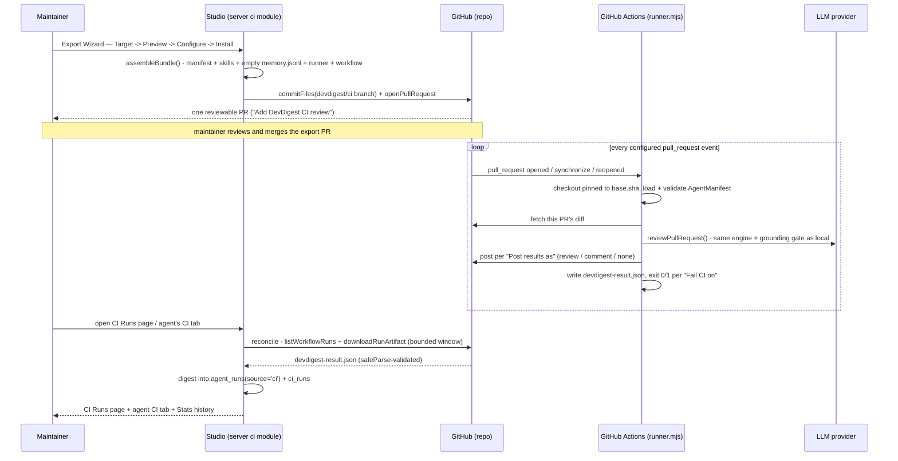

# Export Agents to CI — running a debugged agent automatically on every PR

For a maintainer who has tuned a review agent locally and wants it to review every
pull request in a real repository automatically, without triggering it by hand. Covers
the export workflow (wizard → PR → CI runs), how the exported deployment stays
faithful to the local agent, and how results make their way back into the studio.
The security rationale — the feature's core "why" — gets its own explanation, linked
below rather than repeated here.

Cross-references SPEC-05 (`specs/SPEC-05-2026-07-12-export-agents-to-ci.md`) and its
plan (`docs/plans/export-agents-to-ci.md`); read those for the full acceptance-criteria
list and task-by-task build history. For the review engine this feature runs unmodified
in CI, see [`architecture.md`](architecture.md). For the security design in depth,
including a real vulnerability caught and fixed during review, see
[`adr/0001-ci-export-security-model.md`](adr/0001-ci-export-security-model.md).

## The idea

A review agent that only runs on its author's machine is invisible to the team — it
has to be triggered by hand and its judgement never becomes a shared, enforceable
gate. Exporting an agent turns it into a CI job: the same model, system prompt,
skills, and gate policy the maintainer tuned locally, now running automatically on
every pull request, in GitHub Actions, with its findings visible to everyone and a
blocker able to actually stop a merge.

The two ideas that make this trustworthy rather than a fragile re-implementation:

- **One artifact, two environments.** The agent serializes to a manifest
  (`.devdigest/agents/<slug>.yaml`) validated by exactly one shared Zod schema —
  `AgentManifest` in `contracts/eval-ci.ts` — on both ends: the studio *writes* it
  (`server/src/modules/ci/manifest.ts`), the CI runner *reads* it
  (`runner/src/manifest.ts`). The runner then calls the same `reviewPullRequest()`
  from `reviewer-core` that a local run calls, grounding gate included — not a
  drifted CI-specific re-implementation.
- **The studio never receives a push from CI.** The studio is local; GitHub Actions
  is not. Results are always **pulled** — the studio fetches each run's
  `devdigest-result.json` artifact and Actions metadata on demand and digests the
  aggregates into the existing run model.



## Export a debugged agent to CI

From an agent's editor, open the **CI** tab (alongside Config / Skills / Context /
Evals / Stats). An agent with no CI installations shows "Not in CI yet" — click
**Add to CI** to open the Export Wizard (`ExportWizard`, four steps).

1. **Target** — GitHub Actions is the only selectable target, badged
   "recommended". CircleCI, Jenkins, and a Generic CLI are visible but disabled
   ("coming soon") — placeholders this feature doesn't implement yet.
2. **Preview** — a file tree under **FILES TO CREATE** shows exactly what will be
   committed (see [What gets committed](#what-gets-committed) below). Selecting a
   file shows its full contents with an **editable** badge — inspect and adjust
   before installing.
3. **Configure**
   - **Trigger** — `pull_request:opened` and `pull_request:synchronize` are on by
     default; `pull_request:reopened` is optional.
   - **Post results as** — **GitHub review** (default, the only option that yields a
     verdict), **PR comment**, or **None** (exit code only).
   - A merge-block hint explains the manual steps needed (see
     [Merge-blocking without a GitHub App](#merge-blocking-without-a-github-app)).
4. **Install**
   - **Open a PR with these files** (recommended) — DevDigest makes one atomic
     commit of the full file set onto a `devdigest/ci` branch and opens a PR titled
     "Add DevDigest CI review" in the target repo. Nothing ever lands on the default
     branch directly.
   - **Copy files as a zip** — the same generated file set, for manual installation
     when a PR can't be opened (no write access, or the CI token can't open PRs).
     Also offered automatically as a fallback if opening the PR fails.
   - If a linked skill can't be resolved (a disabled skill link), the export is
     blocked and the skill is named — nothing is ever committed half-built.

**Re-exporting** an agent to a repo it's already installed in updates the
installation in place: the same `devdigest/ci` branch, the same open PR (if one is
still open), and the installation's `workflow_version` is bumped. It never creates a
duplicate installation or a second PR — the export path
(`server/src/modules/ci/service.ts` `install()`) looks up the existing installation
first (`findOpenPr`), so running the wizard twice against the same repo is safe.

**Multiple agents, one repo** work independently: each agent gets its own slug
(derived from its name, disambiguated with `-2`/`-3` on collision —
`server/src/modules/ci/slug.ts`), so a security-focused agent and a style-focused
agent exported to the same repo get their own manifest and workflow file and never
overwrite each other.

## What gets committed

Every install/preview/zip path calls the same "assemble bundle" generator
(`server/src/modules/ci/bundle.ts` `assembleBundle`) so the three paths can never
diverge, and so skill resolution and manifest validation both run — and can both
fail loudly — before anything is committed:

| File | Contents |
|---|---|
| `.devdigest/agents/<slug>.yaml` | The serialized, schema-validated `AgentManifest` |
| `.devdigest/skills/<slug>.md` (one per linked skill) | The skill body, copied verbatim |
| `.devdigest/memory.jsonl` | **Empty.** Memory accrual is out of scope for this feature — see [Accepted limitations](#accepted-limitations) |
| `.devdigest/runner.mjs` | The committed, esbuild-bundled `runner/dist/runner.mjs` build — the entire review engine, in one file |
| `.github/workflows/devdigest-review-<slug>.yml` | The generated GitHub Actions workflow |

Every file is `editable: true` in the Preview tree — this is a starting point a
maintainer can hand-edit before merging the export PR, not a black box.

## The security model

Once this agent is running in CI, it sits at the intersection of an untrusted PR
diff, write access to the PR, and a live API key — the conditions for a genuine
security problem, not a hypothetical one. The generated workflow and runner are
built to be minimal-by-construction against exactly that risk: least-privilege
permissions, a secret that's referenced but never embedded and never reaches a fork
PR, PR content always treated as data, no external/marketplace action, and a
checkout pinned to the PR's base commit — closing a real vulnerability caught during
implementation review (an unpinned checkout would let a PR's own edits to
`.devdigest/runner.mjs` execute with the secret present).

This is documented in full, with the alternatives considered and rejected, in
[ADR 0001](adr/0001-ci-export-security-model.md) — read it before touching
`server/src/modules/ci/workflow.ts` or `runner/src/runner.ts`'s
skip-on-no-credentials branch.

## Merge-blocking without a GitHub App

There's no GitHub App in this product, so blocking a merge on a CI finding is built
from two separate pieces a maintainer wires together:

1. **"Fail CI on"** (agent's CI tab) — **Critical**, **Warning+**, or **Never**.
   Governs the severity at or above which the runner's process exits non-zero. This
   policy is per-agent and applies to all of that agent's installations
   (`agents.ciFailOn`; the exit decision itself is computed by reviewer-core's own
   gate helpers inside the runner, never re-derived).
2. **A required status check**, added by the maintainer in the repo's GitHub branch
   protection settings — turning that non-zero exit into an actual block. DevDigest
   does not and cannot configure this from the studio (it's a repository setting, out
   of this feature's scope).

Both pieces matter: with **Post results as: None** and **Fail CI on: Critical**, a
CRITICAL finding posts nothing visible on the PR at all — the only signal is the
non-zero exit, which is exactly what the required status check is watching.

## Reading CI results back into the studio

The studio never receives a push from GitHub Actions — it **pulls**. Opening the
**CI Runs** page or an agent's **CI** tab triggers an on-demand reconcile
(`POST /ci/reconcile`, `server/src/modules/ci/reconcile.ts`), also available via the
page's **Refresh** button and an auto-refresh indicator. Reconcile is bounded to a
recent window (last 7 days / N runs per installation) — it never scans unbounded
Actions history.

For each installed repo, reconcile lists recent workflow runs, downloads each run's
`devdigest-result.json` artifact, and validates it against the same shared
`CiResultArtifact` schema the runner writes it with (`safeParse` — untrusted input,
even though it's produced by DevDigest's own runner, since it originates from an
environment the PR influenced). The digested aggregates land in two places: a
`ci_runs` row (idempotent, upserted by `(installation, actions_run_id)`, so a
repeated reconcile never double-inserts) and an `agent_runs` row tagged
`source='ci'` — the **same** run model local reviews use, so CI and local runs sit
side by side in an agent's Stats history (AC-42). No per-finding trace is
reconstructed from CI — only aggregates (counts, cost, duration); per-finding detail
stays on the GitHub PR and the linked Actions job.

### Status meanings

| Status | Meaning |
|---|---|
| **Succeeded** | The run completed. This includes a run that found one or more CRITICAL findings and exited non-zero on purpose — the blocked-merge state is conveyed through the verdict and the CRITICAL count, not by this status |
| **No findings** | Completed cleanly with zero findings |
| **Failed** | The runner itself failed to produce a review — a missing artifact (job errored before upload) or one that fails schema validation. Never fabricated findings or cost |
| **Running** | The Actions run hasn't completed yet |
| **Skipped — no credentials** | A fork PR (or a repo secret that isn't configured) — the runner never touched the secret, posted nothing, and never blocks the merge |

Note the distinction that matters most for reading the page correctly: **Succeeded
with a blocker is not the same as Failed.** Both can show "red" in GitHub Actions
(the check itself exited non-zero either way), but they mean opposite things — one
is the gate doing its job, the other is the runner breaking.

### CI Runs page

Sidebar → **CI Runs** (GLOBAL section). Columns: Timestamp, Pull request, Agent,
Source, Duration, Findings (per-severity counts), Cost, Status, and an outbound
**Trace** link to the GitHub Actions job. Filterable by date range, agent, repo,
status, and source. Empty state ("No CI runs yet") links out to exporting an agent.

### Agent CI tab

Once an agent has at least one installation, its CI tab shows "CI deployment", an
"Active in N repos" badge, the **Fail CI on** control, and one row per installed
repo — repo, target, status, workflow version, and last-run time. A repo shows
**"Update available"** when its installed config hash no longer matches the agent's
current config (`installed_config_hash` vs. a hash recomputed fresh from the live
agent + linked skills on every read — see `server/src/modules/ci/service.ts`
`listInstallations`) — a targeted signal for **Update CI config**, distinct from
needing to re-export blind.

## Accepted limitations

Carried over verbatim from the spec's Non-goals — worth knowing before filing these
as bugs:

- **CircleCI, Jenkins, and Generic CLI are UI placeholders only.** Only GitHub
  Actions produces a functional export.
- **`.devdigest/memory.jsonl` ships empty.** Memory accrual across CI runs is future
  work, not implemented here.
- **No branch-protection automation.** Adding the `OPENROUTER_API_KEY` repo secret
  and configuring a required status check are both documented manual steps.
- **No orphaned-workflow cleanup.** Deleting or disabling an exported agent in the
  studio does not remove the committed workflow from the repo — the studio simply
  stops tracking that installation. The repo needs a follow-up edit (or a new
  export) to actually change what's running.
- **No per-finding CI trace in the studio.** Only aggregates are ingested; per-finding
  detail lives on the GitHub PR and the Actions job log.
- **The export PR's own first CI run is a no-op, not a pass/fail verdict.** The
  checkout is pinned to `base.sha` (see the ADR), and the export PR is the one PR
  where `base.sha` doesn't have `.devdigest/runner.mjs` yet — the run step detects
  this and exits with a `::notice::` instead of reviewing. The workflow activates
  starting with the next PR opened after this one merges.

## Verification

```sh
cd runner && node build.mjs && node_modules/.bin/vitest run   # build BEFORE test — the smoke test imports dist/runner.mjs
cd server && node_modules/.bin/tsc --noEmit
cd server && TESTCONTAINERS_RYUK_DISABLED=true ./node_modules/.bin/vitest run .it.test   # server/src/modules/ci/**
cd client && node_modules/.bin/tsc --noEmit && pnpm test
```

See `runner/CLAUDE.md` for why the runner's bundle-parse smoke test must run
against the built `dist/runner.mjs`, not `src/runner.ts`, and `../TESTING.md` for
the repo-wide unit/integration split.
